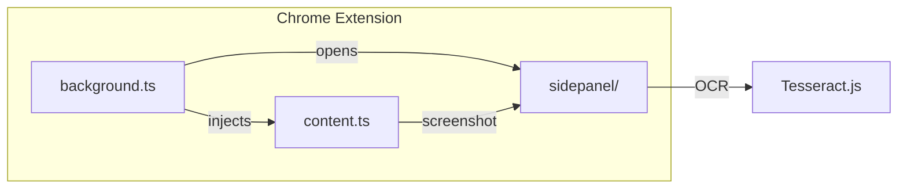

# Online OCR - Chrome Extension

Chrome расширение для извлечения текста из изображений с помощью OCR (Optical Character Recognition).

## Возможности

- Выделение области на странице для извлечения текста
- Распознавание текста с помощью Tesseract.js (работает офлайн)
- Отображение процесса распознавания в side panel
- Копирование распознанного текста в буфер обмена
- Поддержка русского и английского языков

## Технологии

- **Manifest V3** - современный формат Chrome расширений
- **TypeScript** - типизированный JavaScript
- **Vite** - быстрый сборщик
- **Tesseract.js** - клиентская OCR библиотека

## Установка

### 1. Установка зависимостей

```bash
npm install
```

### 2. Создание иконок

Перед сборкой необходимо создать PNG иконки из SVG файла:

```bash
# Используя ImageMagick (если установлен)
convert icons/icon.svg -resize 16x16 icons/icon16.png
convert icons/icon.svg -resize 48x48 icons/icon48.png
convert icons/icon.svg -resize 128x128 icons/icon128.png

# Или используя онлайн конвертер (см. icons/README.md)
```

### 3. Сборка расширения

```bash
npm run build
```

Собранные файлы будут в папке `dist/`.

### 4. Загрузка в Chrome

1. Откройте Chrome и перейдите в `chrome://extensions/`
2. Включите "Режим разработчика" (Developer mode)
3. Нажмите "Загрузить распакованное расширение" (Load unpacked)
4. Выберите папку `dist/`

## Использование

1. Откройте любую веб-страницу
2. Нажмите на иконку расширения в панели инструментов Chrome
3. Side panel откроется автоматически
4. Выделите область на странице, из которой хотите извлечь текст (перетащите мышью)
5. Дождитесь завершения обработки
6. Нажмите "Копировать" для копирования текста в буфер обмена

## Архитектура



### Поток данных

1. **Пользователь** открывает sidepanel через иконку расширения
2. **background.ts** инжектирует content script на страницу
3. **content.ts** показывает overlay для выделения области
4. После выделения **background.ts** делает скриншот вкладки
5. Изображение передаётся в **sidepanel/** для обработки
6. **utils/ocr.ts** выполняет OCR через Tesseract.js
7. Результат отображается пользователю

## Разработка

### Режим разработки с автопересборкой

```bash
npm run dev
```

### Структура проекта

```
├── src/
│   ├── background.ts      # Service worker
│   ├── content.ts         # Content script с overlay
│   ├── sidepanel.html     # HTML side panel
│   ├── sidepanel.ts       # Точка входа side panel
│   ├── sidepanel/         # Модули side panel
│   │   ├── index.ts       # Инициализация, публичный API
│   │   ├── state.ts       # Управление состоянием
│   │   ├── image-processing.ts  # OCR pipeline
│   │   ├── overlay.ts     # Управление overlay
│   │   ├── clipboard.ts   # Вставка из буфера
│   │   ├── drag-drop.ts   # Drag & drop файлов
│   │   └── file-handling.ts    # Валидация файлов
│   ├── utils/
│   │   ├── ocr.ts         # OCR (Tesseract.js)
│   │   ├── languages.ts   # Конфигурация языков
│   │   ├── image-crop.ts  # Обрезка изображений
│   │   ├── pdf-to-image.ts    # Конвертация PDF
│   │   ├── selection.ts   # Управление выделением
│   │   └── language-detection/  # Автоопределение языка
│   │       ├── index.ts   # Основная логика
│   │       ├── scandinavian.ts  # Скандинавские языки
│   │       ├── finnish.ts # Финский
│   │       ├── turkish.ts # Турецкий
│   │       └── indonesian.ts   # Индонезийский
│   ├── types/             # TypeScript типы
│   ├── constants/         # Константы приложения
│   └── styles/
│       ├── overlay.css    # Стили overlay
│       └── sidepanel.css  # Стили side panel
├── docs/
│   └── adr/               # Architecture Decision Records
├── icons/                 # Иконки расширения
├── manifest.json          # Конфигурация расширения
├── vite.config.ts         # Конфигурация Vite
└── tsconfig.json          # Конфигурация TypeScript
```

### Документация модулей

Каждый модуль содержит README.md с описанием:
- `src/sidepanel/README.md` - UI и логика панели
- `src/utils/README.md` - Утилиты OCR и обработки
- `src/types/README.md` - TypeScript типы
- `src/constants/README.md` - Константы

### Architecture Decision Records

Ключевые архитектурные решения документированы в `docs/adr/`:
- [001-tesseract-client-side-ocr.md](docs/adr/001-tesseract-client-side-ocr.md) - Клиентский OCR
- [002-sidepanel-modular-architecture.md](docs/adr/002-sidepanel-modular-architecture.md) - Модульная архитектура
- [003-language-detection-heuristics.md](docs/adr/003-language-detection-heuristics.md) - Автоопределение языка

## Особенности реализации

- **Overlay для выделения**: Кастомный overlay поверх страницы с возможностью рисования рамки мышью
- **Обрезка изображений**: Автоматическая обрезка скриншота по выделенной области
- **Прогресс OCR**: Отображение прогресса распознавания текста
- **Обработка ошибок**: Корректная обработка ошибок с возможностью повтора

## Требования

- Chrome 109+ (для поддержки side panel)
- Node.js 18+

## Лицензия

MIT
